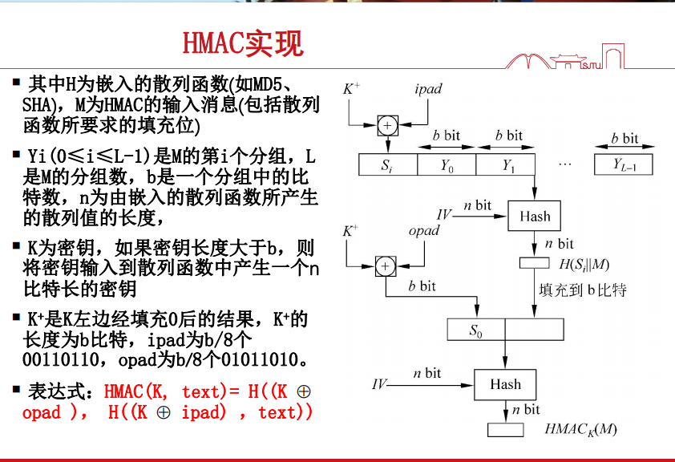

# 网络信息安全概论笔记整合

## 第一章 引言

### 计算机安全概念

1. 计算机安全定义（核心内容，CIA三元组）
   1. 机密性
      1. 数据机密性
      2. 隐私性
   2. 完整性
      1. 数据完整性
      2. 系统完整性
   3. 可用性

### OSI安全体系结构

1. 安全攻击
2. 安全机制
3. 安全服务

### 安全攻击

1. 被动攻击：本质是窃听/监视数据传输，应对被动攻击重点是防范而不是检测
   1. 消息内容泄露攻击
   2. 流量分析攻击：观察交换信息的频率/长度等
2. 主动攻击：数据流的改写/错误数据流的添加
   1. 假冒
   2. 重放
   3. 改写消息
   4. 拒绝服务

### 安全服务

X.800将这些服务划分为5类和14种特定的服务。

1. 认证：确保通信实体身份
   1. 对等实体认证
   2. 数据源认证
2. 访问控制：防止对资源的非授权使用
3. 数据机密性：防止非授权的数巨泄露
   1. 连接机密性
   2. 无连接机密性
   3. 选择域机密性
   4. 流量机密性
4. 数据完整性：确保被认证实体发送的数据和接收到的数据完全相同
   1. 带有恢复的连接完整性
   2. 无恢复的连接完整性
   3. 选择域连接的完整性
   4. 无连接的完整性
   5. 选择域无连接的完整性
5. 不可抵赖性
   1. 不可抵赖性，源
   2. 不可抵赖性，目的地
6. 可用性服务

### 安全机制

1. 特定安全机制：为提供OSI安全服务，可能合并到适当的协议层中
   1. 加密
   2. 数字签名
   3. 访问控制
   4. 数据完整性
   5. 认证交换
   6. 流量填充
   7. 路由控制
   8. 公证
2. 普适的安全机制：没有指定特定OSI安全服务或者协议层的机制
   1. 可信功能
   2. 安全标签
   3. 事件检测
   4. 安全审计跟踪
   5. 安全恢复

### 网络安全模型

---

**以下是第一部分 密码学**

## 第二章 对称加密和消息机密性

### 对称加密原理

发送者和接收者共享密钥K，加密和解密使用同一个密钥。

1. Feistel密码结构

   1. 加密算法的输入是长度为2w比特的明文分组及密钥K。明文分组被分成$L_0$和$R_0$，经过n轮处理后组合成密文分组。
   2. 第$i$轮输入为$L_{i-1}$和$R_{i-1}$，由前一轮产生，子密钥$K_i$由密钥$K$产生

   

   F：轮函数

   解密的时候逆序使用子密钥$K_i$，即第一轮使用$K_n$，第二轮使用$K_{n-1}\cdots$。

### 典型分组密钥加密算法

1. DES算法

   1. 明文长度64比特，密钥长度56比特，更长的明文被分为64比特的分组来处理。
   2. 在Feistel网络的基础上做了微小变化，采用16轮迭代，从原始56比特密钥产生16组子密钥，每一轮迭代使用一个子密钥。
   3. DES强度：穷举攻击，可选密钥数$2^{56}$。

2. 3DES算法：使用三个密钥执行三次DES算法，加密-解密-加密（EDE）
   $$
   C=E(K_3,D(K_2,E(K_1,P)))
   $$
   C是密文，P是明文。解密采用相反顺序进行相同的操作
   $$
   P=D(K_1,E(K_2,D(K_3,C))
   $$

   1. 密钥长度168比特，牛！

3. AES算法

   1. 使用的分组大小为128比特，密钥长度可以为128，192或256比特。
   2. 不是Feistel结构

### 分组密码工作模式

1. 电子密码本（ECB）模式：明文一次被处理b比特，而且明文的每一个分组都使用同一密钥加密。对于给定的密钥，每个b比特的明文分组对应唯一的密文。

   坏处：如果一个明文分组出现了不止一次，总是产生相同的密文，因此对于过长的消息，ECB模式可能不安全。

2. 密码分组链接（CBC）模式：加密算法的输入是当前明文分组与迁移密文分组的异或，每个分组使用同一密钥。

3. 密码反馈（CFB）模式：将任意分组密码转化为流密码

   1. 适合数据以比特或字节为单位出现，错误传播
   2. 消息被看作bit流，被加到分组密文的输出，并把结果反馈到下一阶段
   3. 允许反馈任意比特

4. 计数器模式（CTR）

   1. 计数器被加密然后与明文分组异或产生密文分组
   2. 随着消息块的增加，计数器的值增加1
   3. 并行处理多块明文，加解密同时进行

## 公钥密码和消息认证

### 消息认证方法

消息认证码（MAC）和散列函数进行消息认证。

1. 常规加密的消息认证：分组的重排是一种威胁。

2. 非加密的消息认证

   1. 消息认证码：假设两个通信实体共享一个公共密钥$K_{AB}$。当A发送消息时，A计算消息认证码MAC，作为消息和密钥的一个函数：$MAC_M=F(K_{AB},M)$. 推荐生成MAC的算法是DES.
   2. 单向散列函数hash function：散列函数接收变长的消息M作为输入，生成定长的消息摘要$H(M)​$作为输出。散列函数不需要密钥输入。为了认证消息，消息摘要随消息一起以可信的形式发送。

3. 散列函数的要求

   1. 单向性：抗原像攻击性（找不到反函数）
   2. 抗第二原像攻击性，抗弱碰撞攻击性（$for\quad a\quad given\quad x,cannot\quad find\quad a\quad y\neq x,H(y)=H(x)$。）
   3. 抗碰撞性（抗强碰撞性）：$for\quad any\quad x, cannot \quad find \quad a\quad y\neq x, H(y)=H(x)$

4. 常用的hash算法

   1. RSA

   2. MD5(128 bit)

      1. 将数据分成512-bit块，MD5可以输入任意长度的明文，产生128位的摘要
      2. MD5算法已经被破解了

   3. SHA

      1. 与处理完后的明文长度是512位的整数倍。SHA的输出是160位，分别存储于5个32位的记录单元中
      2. 特点
         1. 安全性：比MD5多了32位
         2. 速度：比MD5慢了25%
         3. 简易性：每一步的操作描述比MD5更简单

   4. RIPEMD-160

   5. HMAC

      1. 基于分组加密算法产生，可以与任何迭代散列函数捆绑使用

      2. hash函数可以用来构造MAC：散列函数不能直接用于MAC，将散列函数与密钥结合起来产生鉴别码，称为基于散列函数的报文鉴别码HMAC

         

