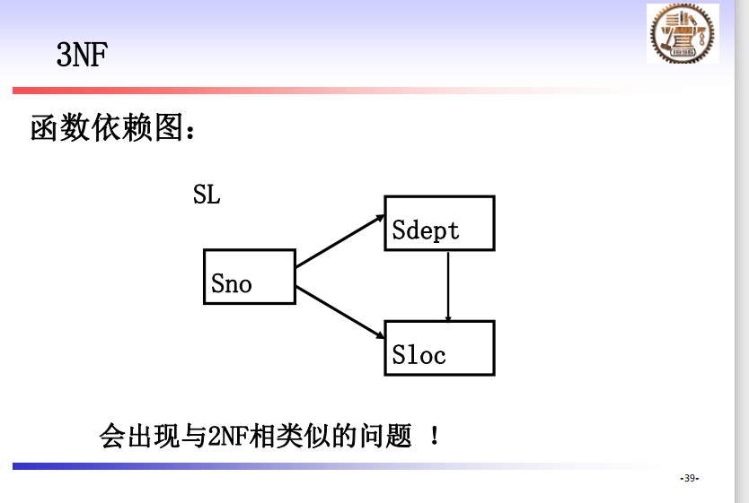
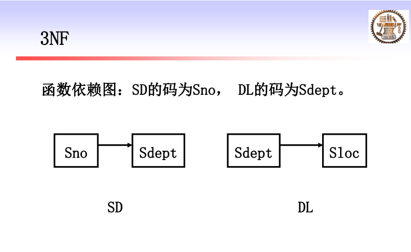

# 数据库笔记

## 第一章 系统概论

1. 数据库系统概述

   1. 四个基本概念：Data，DB，DBMS，DBS

      1. DB基本特征：数据按一定数据模型组织描述和储存；可为各种用户共享；冗余度较小；数据独立性较高；易扩展。

      2. DBMS是位于用户与操作系统之间的一层数据管理软件，可以科学地组织存储数据、高效地获取和维护数据。

         主要功能有

         1. 数据定义功能：提供数据定义语言DDL
         2. 数据组织、存储、管理功能
         3. 数据操纵功能：提供数据操纵语言DML，操纵数据实现基本操作，增删改查
         4. 数据库的事务管理和运行管理
         5. 数据库的建立和维护功能

      3. DBS是指在计算机系统中引入数据库后的系统构成，DBS由DB、DBMS、应用系统、数据库管理员和用户构成。

   2. 数据库管理技术的历史发展

      1. 人工管理阶段（40s-50s中）
         1. 外存只有磁带卡片纸带，没有直接存储设备，没有操作系统和管理数据的软件；
         2. 特点：
            1. 数据不保存，没有文件的概念
            2. 数据与程序不具有独立性
            3. 数据的组织方式自行设计，冗余度大
            4. 应用程序与数据**一一对应**，数据面向应用程序
      2. 文件系统阶段（50s末-60s中）
         1. 有文件系统
         2. 特点：
            1. 数据的管理者：文件系统，数据可长期保存
            2. 数据面向的对象：某一应用程序
            3. 数据共享性差，冗余度极大
            4. 数据独立性差
            5. 整体无结构数据
      3. 数据库系统阶段（60s末-now）
         1. 有DBMS
         2. 特点：
            1. DBMS管理数据
            2. 面向对象：现实世界
            3. 共享性高，冗余度小
            4. 高度的物理独立性和一定的逻辑独立性
            5. 整体结构化，用数据模型表示
            6. 由DBMS统一控制

   3. 数据库系统的特点

      1. 数据的结构化：
         1. 整体数据的结构化
         2. 数据的结构用数据模型描述，无需程序定义和解释
         3. 数据可以变长。数据的最小存取单位是数据项。
      2. 数据独立性
         1. 物理独立性：物理存储改变，应用程序不改变。
         2. 逻辑独立性：逻辑结构改变，应用程序不改变。
      3. 数据的高共享性
         1. 面向整个系统，可以被多个用户、多个应用共享使用
         2. 好处：
            1. 降低数据的冗余度、节省存储空间。
            2. 避免数据间的不一致性和不相容性
            3. 使系统易于扩充。
      4. 对数据的控制能力
         1. 安全性保护
         2. 完整性检查
         3. 并发控制
         4. 数据库恢复

2. 数据模型

   1. 两类数据模型：

      1. 概念模型：信息模型，按照用户的观点对数据和信息建模；
      2. 逻辑模型和物理模型：
         1. 逻辑模型，主要包括网状模型、层次模型、关系模型等，是按照计算机系统的观点对数据建模
         2. 物理模型，是数据最底层的抽象，描述数据在系统内部的表示方式和存取方法

   2. 数据模型的组成要素

      1. 数据结构：静态特性
      2. 数据操作：动态特性
      3. 完整性约束

   3. 概念模型：ER图

      1. 实体型用矩阵表示，矩形框内写明实体名
      2. 属性用椭圆形表示，并用无向边将其与对应的实体连起来
      3. 联系：注意标注联系类型（1:1,1:n,m:n）；联系也可以具有属性。

   4. 常用数据模型

      1. 格式化模型（第一代数据库）

         1. 数据结构：以基本层次联系为基本单位

         2. 层次模型

            1. 实体型用节点表示，属性用字段表示，联系用节点之间的有向边记录类型之间一对多的父子联系

            2. 特点：

               1. 结点的双亲是唯一的
               2. 只能直接处理一对多的实体联系
               3. 每个记录类型定义一个排序字段
               4. **任何记录值只有按其路径查看时才能显出全部意义**
               5. 没有一个子女记录值能够脱离双亲记录值独立存在

            3. 多对多联系在层次模型中的表示：

               1. 将多对多联系分解成一对多联系
               2. 分解方法：
                  1. 冗余结点法
                  2. 虚拟结点法

            4. 完整性约束

               1. 无双亲则无子女
               2. 如果删除双亲则子女也被删除
               3. 更新操作时应更新所有相应记录

            5. 优缺点

               1. 优点
                  1. 层次数据模型简单，便于表示一对多联系
                  2. 查询效率高
                  3. 提供良好的完整性支持
               2. 缺点：
                  1. 多对多不方便
                  2. 对插入和删除操作限制多
                  3. 查询子女需要找双亲
                  4. 查询、更新操作必须给出完整路径

            6. 实例

               

         3. 网状模型

            1. 特点：

               1. 允许一个以上的结点无双亲
               2. 一个结点可以有多于一个的双亲

            2. 表示方法：与层次模型相同

            3. 层次模型是网状模型的一个特例

            4. 实例

               

      2. 关系模型（第二代数据库）

         1. 数据结构：表
         2. 完整性约束
            1. 实体完整性
            2. 参照完整性
            3. 用户定义完整性
         3. 优缺点
            1. 优点：
               1. 建立在严格的数学概念基础上
               2. 概念单一，数据结构简单清晰
               3. 存取路径对用户透明
            2. 缺点
               1. 存取路径对用户隐蔽，导致查询效率较低
               2. 必须对用户的查询请求进行优化，增加了开发数据库管理系统的难度

      3. 新一代数据库

3. 数据库系统结构：三级模式

   

   1. 三级模式：对数据的三个抽象级别
      1. 模式：也称逻辑模式，是数据库中全体数据的逻辑结构和特征的描述；一个应用数据库只有一个模式，以数据模型为基础。是数据库系统模式结构的中心
      2. 外模式：子模式/用户模式，是数据库用户使用的局部数据的逻辑结构和特征的描述。介于模式和应用之间；模式与外模式、外模式与应用之间的关系都是一对多
      3. 内模式：存储模式，是数据物理结构和存储方式的描述，一个数据库只有一个内模式。
   2. 二级映像：在DBMS内部实现三级模式抽象层次的联系和转换
      1. 外模式/模式映象：每一个外模式对应一个映象，用来保证数据的逻辑独立性。应用程序是依据外模式编写的，从而保证应用程序不必修改；当模式改变时，只需要修改对应映象就可以使外模式保持不变。
      2. 模式/内模式映象，在一个数据库中是唯一的，通常包含在模式描述中。定义了数据全局逻辑结构与存储结构之间的对应关系，保证了数据的物理独立性，即当数据库的存储结构改变，数据库管理员修改模式/内模式映象，使模式不变。

## 第二章 关系模型与关系代数

1. 笛卡尔积

   1. 基数：元素个数

2. 码
   1. 候选码（Candidate Key）：若某一属性组能够唯一标识一个元组，称该属性组为候选码。
   2. 主码（Primary Key）：一组候选码
   3. 主属性：候选码的诸属性称为主属性
   4. 外码：F是关系R的一个或一组非码属性。如果F与另一个关系S的主码$K_s$相对应，则称F是R的外码。R是参照关系，S是被参照关系/目标关系。

3. 完整性

   1. 实体完整性：主码不能为空
   2. 参照完整性：外码只能为空或被参照关系中已经存在的值。
   3. 用户定义完整性

4. 关系代数

   1. 象集：给定一个关系R（X,Z），X和Z为属性组。当$t[X]=x$时，x在R中的象集（Image Set）为
      $$
      Z_x=\{t[Z]|t\in R, t[X]=x\}
      $$
      $Z_x$标识X=x时对应的Z值的集合。

      

   2. 连接：也被称为$\theta$连接

      

      ​	$\theta$：比较运算符；

      ​	A和B：分别为R和S上度数相等且可比的属性组

      1. 连接运算的含义：

         连接运算从R和S的广义笛卡尔积$R\times S$中选取R关系在A属性组上的值与S关系在B属性组上值满足比较关系的元组。

      2. 常用的连接运算

         1. 等值连接：$\theta$为相等关系
         2. 自然连接：自动去除重复属性列
            1. 产生悬浮元组：相等的属性列中不含有相等属性值对应的元组，一般舍弃，如果把悬浮元组保存在结果关系中而在其他属性上填NULL，则称外连接。

   3. 除运算：对于R和S中共有的属性列进行除运算，被除关系中对除了共有属性以外的属性求象集，找一个包含了除关系中所有共有属性元组的象集对应的象就是除法的结果。

      

## 第三章 关系规范化

1. 数据依赖

   1. 函数依赖

      1. $X\rightarrow Y$，称X函数确定Y，或Y函数依赖于X。
      2. 完全函数依赖：不可再分的最小依赖；
      3. 部分函数依赖：可再分，存在真子集仍然满足依赖关系
      4. 函数依赖是语义范畴的概念。

   2. 平凡函数依赖与非平凡函数依赖

      1. 平凡函数依赖必然成立

      2. 非平凡函数依赖比较重要

         

   3. 完全函数依赖与部分函数依赖

   4. 传递函数依赖

2. 关系规范化

   几个范式：

   1. 第一范式（1NF）

      需要表中无表，属性列不可再分。

      

      可以看出存在部分函数依赖（虚线）和传递函数依赖（回路）

   2. 第二范式（2NF)

      在第一范式基础上，消除部分函数依赖

      

      可以看出存在传递函数依赖（回路）

   3. 第三范式（3NF）

      在第二范式基础上，消除了非主属性对码的传递函数依赖

      

   4. BC范式（BCNF）

      在第三范式的基础上，不考虑平凡函数依赖，使所有属性都完全函数依赖于码；消除了主属性对码的部分和传递函数依赖

      举例：
      $$
      (S,J)\rightarrow P;(J,P)\rightarrow S\quad is \quad BCNF
      $$

      $$
      while \quad (S,J)\rightarrow T,(S,T)\rightarrow J,T\rightarrow J \quad is \quad 3NF
      $$

   5. 第四范式

   6. 第五范式

## 第四章 SQL语言

1. SQL语言概述

   

2. 具体语句

   1. 模式定义与删除

      ```mysql
      > create schema <模式名> authorization <用户名>;
      > drop schema <模式名> <cascade|restrict>
      ```

      cascade表示级联地删除，restrict表示有限制地删除，若模式下定义了表则不删。

   2. 基本表的定义、删除与修改

      1. 定义

         ```mysql
         create table student(
         Sno char(9) primary key,
         Sname char(20) unique,
         Ssex char(2) not null,
         Sage smallint,
         Sdept char(20)
         );
         ```

         注意完整性约束（主码、外码等）

         ```mysql
         create table sc(
         Sno char(9),
         Cno char(4),
         grade smallint check(grade>=0 and grade <=100),
         primary key(Sno,Cno),
         foreign key(Sno) references student(Sno),
         foreign key(Cno) references cource(Cno)
         )
         ```

      2. 修改：`alter`

         ```mysql
         alter table student add S_entrance date;
         ```

         新增加的列一律取空值

         ```mysql
         alter table student alter column Sage int;
         ```

         ```mysql
         alter table course add unique(Cname);
         ```

      3. 删除：

         ```mysql
         drop table <表名> [restrict|cascade];
         ```

   3. 索引的建立与删除

      1. 建立索引：

         ```mysql
         create [unique] [cluster] index <索引名> on <表名>(<列名>[<次序>]...)
         ```

         ```mysql
         create cluster index Stusname on Student(Sname);
         ```

         1. 在Student表的Sname列上建立一个聚簇索引

         2. 在最经常查询的列上建立聚簇索引以提高查询效率

         3. 一个基本表上最多只能建立一个聚簇索引

         4. 经常更新的列不宜建立聚簇索引

         5. Unique索引：

            1. 对于已含重复值的属性列不能建unique索引
            2. 对某个列建立unique索引后，插入新纪录时DBMS会自动检查新纪录在该列上是否取了重复值，相当于增加了一个unique约束。

            

      2. 修改索引：

         ```mysql
         alter index <旧索引名> rename to <新索引名>
         ```

      3. 删除索引：`drop index <索引名>`

   4. 数据查询

      ```mysql
      select [all|distinct] <目标列表达式> [,<目标列表达式]……
      from <表名或视图名>[,表名或视图名]……
      [where <条件表达式>]
      [group by <列名1> [having <条件表达式>]]
      [order by <列明2>[asc|desc]]
      ```

      1. 单表查询

         1. 查询经过计算的值

         2. 使用列名改变查询结果的列标题

         3. 加上`distinct`，去除重复元组

         4. `where`子句中使用`between`限定范围

         5. 字符串匹配`like`：

            ```mysql
            select * from student where Sno like '201215121';
            ```

            当匹配字符串为常值时，可以用`=`代替`like`

            可以使用通配符匹配字符串，用`\`转义

            

         6. 涉及空值的查询：

            使用谓词`is null`或`is not null`，不能用`=null`

         7. 结果排序：`order by`默认`asc`，可以跟多个属性列

         8. 聚集函数

            **`where`子句不能用聚集函数作为条件表达式**

            除`count(*)`以外都只处理非空值

            1. `count`
            2. `sum`
            3. `avg`
            4. `max`
            5. `min`

         9. 结果分组`group by`

         10. `having`筛选结果：

             **`where`子句作用于基本表或视图，选择满足条件的元组；`having`短语作用于组，从分好的组中选择满足条件的组;**

             ```mysql
             select Sno from Sc
             group by Sno
             having count(*)>3;
             ```

             ```mysql
             select Sno,AVG(Grade) from Sc
             group by Sno
             having AVG(Grade)>=90;
             ```

      2. 连接查询

         1. 等值/非等职连接查询

            ```mysql
            select Student.*,SC,* from Student,Sc
            where Student.Sno=SC.Sno
            ```

            自然连接：去掉重复的属性列：`select`的时候不选

         2. 自身连接：需要给表起别名以示区别

            ```mysql
            select first.Cno,second.Cpno
            from Course first,Course second
            where first.Cpno=second.Cno;
            ```

         3. 外连接：输出悬浮元组

            ```mysql
            select student.Sno,Sname,Ssex,Sage,Sdept,Cno,Grade
            from Student left outer join Sc on
            (Student.Sno=SC.Sno);
            ```

         4. 复合条件连接

      3. 嵌套查询

         1. 一个`select-from-where`语句称为一个查询块，把一个查询块嵌套在另一个查询块的`where`子句或`having`短语的条件中的查询称为嵌套查询

         2. 允许多层嵌套，但子查询有限制

            1. 子查询的`select`语句中不能使用`order by`子句
            2. `order by`子句只能对最终查询结果排序
            3. 有些嵌套查询可以用连接运算替代

         3. 引出子查询的谓词

            1. `in`

            2. 比较谓词

            3. `any`或`all`谓词

               `any`：某一个值，`all`：所有值

               `!=`可以写成`<>`

            4. `exists`：返回`true`或者`false`

               ```mysql
               select Sname
               from Student 
               where exists(
               		select * from SC
               		where Sno=Student.Sno and Cno='1')
               ```

               执行步骤是遍历所有元组，返回使`where`为`true`的那些元组的`Sname`属性

         4. 嵌套查询分类

            1. 不相关子查询：父子查询不相关，分步执行，一般用`in`

            2. 相关子查询：子查询的查询条件依赖于父查询

               ```mysql
               //找出每个学生超过他选修课程平均成绩的课程号
               select Sno,Cno
               from SC x
               where grade >=(select AVG(grade)
                             	from SC y
                             	where y.Sno=x.Sno)
               ```

      4. 集合查询：并交差，就是两个`select`查询结果进行运算

         1. 并：`union`
         2. 交：`intersect`
         3. 差：`except`

   5. 空值

      1. 运算规则：
         1. 空值与另一个值的算术运算结果为空值
         2. 空值与另一个值的比较运算结果为UNKNOWN

   6. 视图

      1. 虚表
      2. 基表改变，视图也改变

      ```mysql
      create view <视图名> [(<列名>)] as <子查询> [with check option];
      > create view IS_student
      	as
      	select Sno,Sname,Sage
      	from Student	//这里也可以放视图
      	where Sdept='IS'
      	with check option;
      ```


## 第五章 数据库设计

1. 数据库设计的定义：对于给定的应用环境，构造优化数据库逻辑模式和物理结构，建立应用系统满足用户应用需求。

2. 数据库设计的基本步骤：6个阶段

   1. 需求分析：利用数字字典
   2. 概念结构设计
   3. 逻辑结构设计
   4. 物理结构设计
   5. 数据库实施
   6. 数据库运行和维护

   - 需求分析和概念设计独立于任何DBMS
   - 逻辑设计和物理设计和DBMS密切相关

   ---

   1. 需求分析阶段：描述用户现实世界的具体应用需求

      数字字典：

      1. 数据项：不可再分的数据单位，如学号
      2. 数据结构：反映数据之间的组合关系，如学生
      3. 数据流：数据结构在系统内传输的路径，如体检结果
      4. 数据存储：是数据结构停留或保存的地方，也是数据流的来源和去向之一
      5. 处理过程

   2. 概念结构设计阶段：将需求分析得到的用户需求抽象为信息结构即概念模型，是各种数据模型的共同基础，比数据模型更独立于机器，更抽象更稳定，是整个数据库设计的关键

      1. 利用E-R图。**E-R图的合并**
         1. 冲突
            1. 属性冲突：属性值的类型、取值范围或取值集合不同；属性取值单位冲突
            2. 命名冲突
               1. 同名异义
               2. 异名同义
            3. 结构冲突
               1. 同一对象在不同应用中具有不同的抽象
               2. 同一实体在不同分ER图中所包含的属性个数和属性排列次序不完全相同
               3. 实体之间的联系在不同局部视图中呈现不同的类型
      2. 概念结构设计的四类方法
         1. 自顶向下
         2. 自底向上
         3. 逐步扩张
         4. 混合策略

   3. 逻辑结构设计阶段：E-R图向关系模型的转换

      1. 关系模型的逻辑结构是一组关系模式的结合
      2. 将E-R图转换成关系模型，需要将实体与实体的属性和实体之间的联系转化为关系模式

      **E-R图向关系模型的转换**

      1. 一个实体型转换成一个关系模式：

         学生（<u>学号</u>,姓名，……）

      2. 一个m:n联系转换成一个关系模式

         选修（<u>学号</u>,<u>课程号</u>,成绩）

      3. 一个1：n联系可以转换成一个独立的关系模式，也可以与n端对应的关系模式合并

         1. 转换成独立的关系模式
         2. 向n端合并：

## 第六章 数据库安全

1. 计算机安全概述

   1. TCSEC/TDI安全级别划分

      

   C2是安全产品的最低档。

2. 数据库安全性控制

   1. 用户标识和鉴定：系统提供的最外层安全保护措施

      主要方法：

      1. 静态口令鉴别
      2. 动态口令鉴别
      3. 生物特征鉴别
      4. 智能卡鉴别

   2. 存取控制

      1. 存取控制机制的组成：

         1. 定义用户存取权限
         2. 合法存取权限检查

      2. 常见存取控制方法：

         1. 自主存取控制：DAC，C2级：在sql中通过grant和revoke语句实现

            ```mysql
            grant select on table Student to User1;
            grant all priviliges on table student,course to public;
            ```

            利用revoke语句实现全线的回收

            ```mysql
            revoke update(Sno) on table Student from public;
            ```

            1. 自主存取控制方法：
               1. 检查存取权限：DBMS查找数据字典，根据权限对操作的合法性进行检查
               2. 授权粒度：粒度越细，可以定义的数据对象的范围越小，授权子系统越灵活

         2. 强制存取控制：MAC，B1级

            1. 不是用户能直接感知或进行控制的

            2. 全部实体被分为主体和客体两大类

               1. 主体是系统中的活动实体
                  1. DBMS中管理的实际用户
                  2. 代表用户的进程
               2. 客体是系统中的被动实体，是受主体操纵的
                  1. 文件
                  2. 表
                  3. 索引
                  4. 视图

            3. 强制存取控制方法：

               1. 敏感度标记：对主体和客体，DBMS为它们每个实例指派一个敏感度标记（对于主体称许可证级别，对于客体称密级）

                  1. TOP Secret
                  2. Secret
                  3. Confidential
                  4. Public

                  某一主体对其他客体的存取需要遵循两条规则：

                  1. 主体的许可证级别$\ge$客体的密级，主体可以读取相应客体；
                  2. 主体的许可证级别$=$客体的密级，主体才能写相应客体。

                  还可以修正为：

                  1. 主体的许可证级别$\le$客体的密级，主体能写客体
                  2. 用户可以为写入的数据对象赋予高于自己许可证级别的密级
                  3. 一旦数据被写入，该用户自己也不能再读该数据对象。

                  核心反正是禁止拥有高许可证级别的主体更新低密级的数据对象

         3. MAC和DAC共同构成了DBMS的安全机制，实现MAC要首先实现DAC

   3. 视图：把要保密的数据对无权存取这些数据的用户隐藏起来，对数据提供一定程度的安全保护

   4. 审计：启动一个专用的Audit Log将用户对数据库的所有操作记录在上面。C2以上安全级别的DBMS必须具有审计功能

      1. 审计分为

         1. 用户级审计：记录用户SQL操作
         2. 系统级审计
            1. DBA设置
            2. 检测登陆要求
            3. 检测Grant和Revoke操作以及其他数据库级权限下的操作

      2. 审计语句

         ```mysql
         audit alter update on SC;
         ```

   5. 数据加密

   6. 统计数据库安全性

      1. 统计数据库的特点：
         1. 允许用户查询聚类类型的信息
         2. 不允许查询单个记录信息
      2. 统计中的安全性问题
         1. 隐蔽的信息通道
         2. 从合法的查询中推导出不合法的信息

---

## 重点题型：

1. 关系模式的分解，范式的提升
2. E-R图的合并