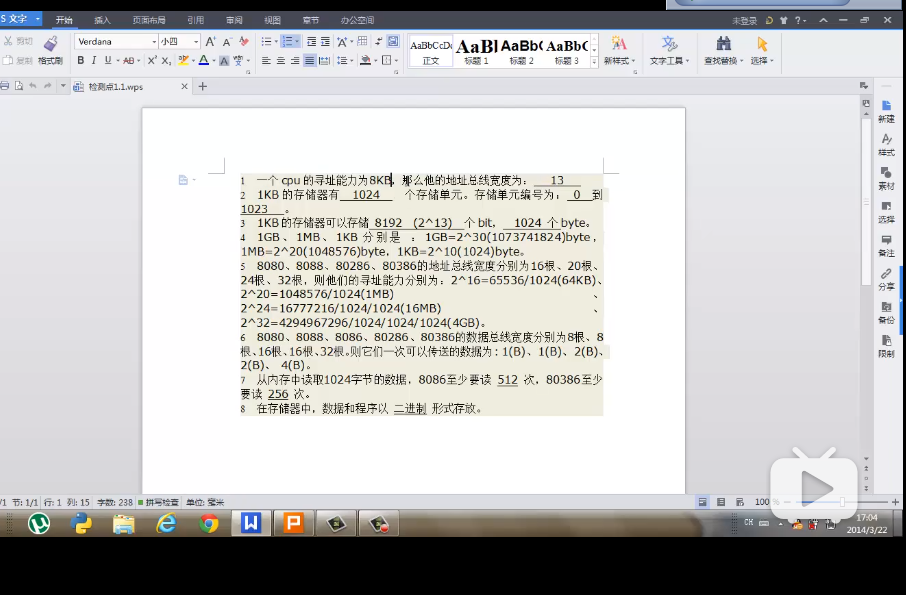

# 8086汇编笔记以及习题

## 检测点1.1


1. 13位

2. 1024；0~1023;

3. $2^{13};2^{10}$

4. $2^{30};2^{20};2^{10}$

5. 64;1;16;4

6. $256;256;2^{16},2^{16},2^{32}$

   1. 做错了！
   2. hint：数据总线宽度为$n$，则传输$n$位。

7. 4;1

   1. 做错了！
   2. 根据数据总线宽度来看，8086一次传输2B，80386一次传输4B.

8. 二进制

   


## 检测点2.x

### 笔记

8086CPU有14个寄存器。全是16位的。

1. 通用寄存器：AX BX CX DX；可以拆分成高八位寄存器和低八位寄存器。

   

2. 指令：

   1. move 寄存器 立即数	move 寄存器 寄存器
   2. add 寄存器 立即数        add 寄存器 寄存器
   3. 两个操作对象位数一致

   实例：

   ```
   mov ax,1234H
   ```

   其实是把12放进了ah，把34放进了al。

   AH,AL是两个八位寄存器，可以表示$2^8=16^2=256$种情况，正好可以容纳两位十六进制数。

3. 8086有20条地址总线，但是传输只能16位。因此采用两个16位地址合成20位物理地址。（段地址+偏移地址合成20位物理地址）

   1. 地址加法器：物理地址=段地址$*16+$偏移地址（段地址左移一位再加上物理地址）

4. CS：IP

   1. 段地址由段寄存器指定。8086有四个段寄存器：CS,DS,SS,ES。如果段地址在CS中，偏移地址一定在IP中

   2. CS为代码段寄存器，IP为指令指针寄存器，指示了CPU当前要读取指令的地址。8086CPU将CS:IP指向的内容当作当前指令执行。

   3. 得到物理地址的形式一般写成`段寄存器:偏移地址寄存器`

      

5. jmp

   1. mov不能对CS:IP进行操作，使用jmp可以改变。跳转。

      

### 习题

## 检测点3

### 笔记

1. 字：2字节，16位。一个字用两个地址连续的内存单元存放。

2. DS：用于存放要访问数据的段地址。

   1. DS不可以赋立即数，必须通过寄存器中转

      ```
      mov bx,1000H
      mov DS,BX
      ```

      而不可以

      ```
      mov DS,1000H
      ```

   2. 类似于指针的操作

   ```
   mov al,[0]
   ```

   `[0]`表示偏移地址是ds:0000中所保存的内容。段地址默认为DS。从而这个语句等效为

   ```
   mov al,DS:[0]
   ```

   如果语句为

   ```
   mov ax,[0]
   ```

   则等效为将从DS:0000H开始的16位内容放入ax。

   

3. 栈操作

   ```
   // 入栈和出栈是以字为单位
   push ax //将寄存器ax中的数据入栈
   pop ax	//将栈顶元素出栈放入ax中
   ```

   1. SS:SP指向栈顶元素
   2. push，pop详解
      1. push ax：
         1. sp=sp-2，以当前栈顶前面的单元为新的栈顶。
         2. 将ax中的内容送入ss：sp指向的内存单元处，ss:sp此时指向新的栈顶。
      2. pop ax
         1. ss：sp处的单元送入ax
         2. sp+=2

### 习题

## 检测点4

1. 源代码结构分析

   

## 检测点5：[bx]和loop

### 笔记

1. 立即数和[dx]默认的段寄存器都是ds

2. 用（）表示一个寄存器或内存单元中的内容。

   

3. loop指令

   1. loop做循环指令，cx放循环次数。每次循环cx自减。cx为0时循环结束

      ```8086
      assume cs:code
      code segment
      	mov ax,2
      	
      	mov cx,11	//11是十进制
      s:	add ax,ax	//2^i
      	loop s		/cx-1；若cx不为0则执行s
      	
      	mov ax,4c00h
      	int 21h
      code ends
      end
      ```

## 检测点6

### 笔记

1. 程序与段的关系

   ```
   assume cs:code	//通过assume把code和代码段寄存器cs关联
   code segment
   	---
   	---
   code ends
   end
   ```

   存储数据：定义数据段/栈

   ```
   assume cs:code
   code segment
   	//dw定义字大小的空间
   	dw 0123h,0456h,0789h,0abch,0defh,0fedh,0cbah,0987h
   	
   start:	//从当前行开始代码执行，如果删去则会把0123h等数据当成指			//令执行
   	mov bx,0
   	mov ax,0
   	
   	mov cx,8
   s:	add ax,cs:[bx]
   	add bx,2
   	loop s
   	
   	mov ax,4c00h
   	int 21h
   code ends
   
   end start
   ```

2. 代码段中使用数据

3. 代码段中使用栈

   

   每次push，sp都会$-2$。

4. 段的分治

   ```assembly
   datasg segment
   ---
   dataseg ends
   
   stacksg segment
   	dw 0,0,0,0,0,0,0
   stacksg ends
   
   codesg segment
   assume cs:codesg
   codesg ends
   ```

   