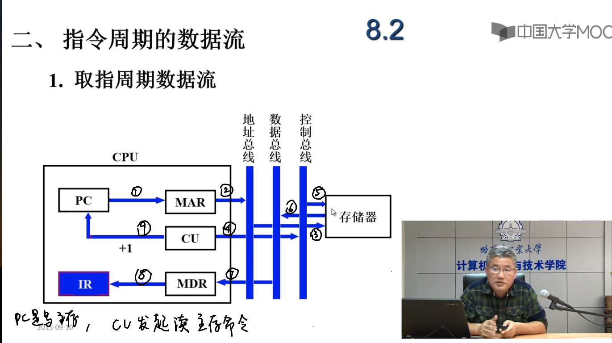
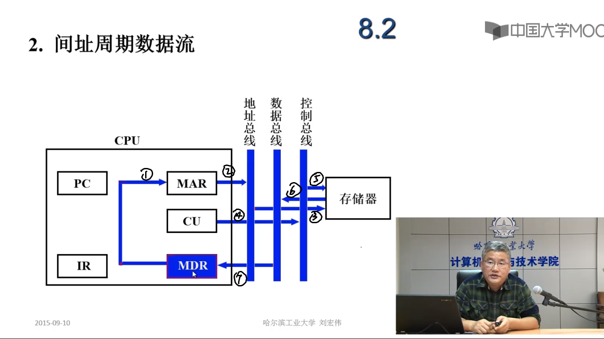
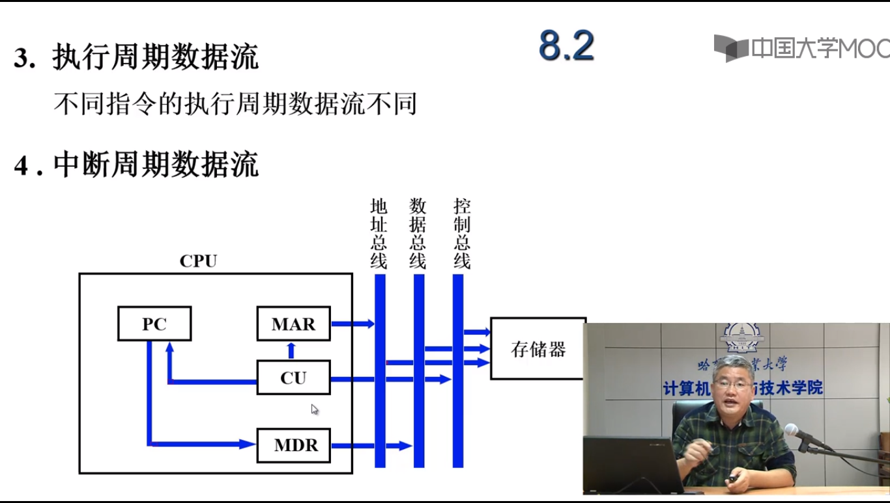

### 8.2 指令周期

1. 指令周期基本概念

   1. 指令周期：取出并执行一条指令所需的全部时间
   2. 指令周期包括：取指，分析（取值周期）、执行（执行周期）
   3. 每条指令的指令周期不同
   4. 具有间接寻址的指令周期：指令周期中加入间址周期
   5. 具有中断周期的指令周期：在执行周期后加入中断周期。
   6. 指令周期流程
   7. CPU工作周期的标志
      1. CPU访存的四种性质
         1. 取值周期：取指令
         2. 间址周期：取地址
         3. 执行周期：存取操作数或结果
         4. 中断周期：存程序断点

2. 指令周期的数据流

   1. 取值周期数据流

      CU（Control Unit）是程序控制单元

      

   2. 间址周期数据流

      

      初始MDR中存放一个地址，该地址中存放操作数的地址。MDR送入MAR写存储器，CU发起读操作可以读到操作数的地址，放在MDR中。

   3. 执行周期数据流

   4. 中断周期数据流

      

      1. 保存程序断点：由CU给出地址，放入MAR，传送给地址总线保存在村出现

         CU发起写命令，向控制总线发起写命令，保存在存储器中；

         程序的入口地址保存在PC中，PC在MDR中

      2. 中断服务程序的入口地址在CU中，CU直接写

   

   ### 8.3 指令流水

   1. 如何提高机器速度

      1. 提高访存速度

         高速芯片 Cache 多体并行

      2. 提高I/O和主机之间的传送速度：中断 DMA 通道 I/O处理机 多总线

      3. 提高运算器速度：告诉芯片 改进算法 快速进位链

      4. 提高整机处理能力：高速器件 改进系统结构，开发系统并行性

   2. 系统的并行性

      1. 并行
         1. 并发：两个或以上时间在同一时间段内发生
         2. 同时：两个或以上时间在同一时刻发生
      2. 并行性的等级
         1. 过程级（程序、进程）			粗粒度	软件实现
         2. 指令级（指令之间）（指令内部）细粒度   硬件实现

   3. 指令流水原理

      1. 指令的串行执行

      2. 指令的二级流水（取值周期、执行周期）

      3. 影响二级流水效率加倍的因素

         1. 执行时间>取值时间
         2. 条件转移指令：必须等上一条指令执行结束才能确定下条指令的地址，造成时间损失

      4. 六级流水

         FI取值、DI译指、CO生成操作数地址、FO取操作数、EI执行、WO写回

   4. 影响指令流水线性能的因素

      1. 结构相关：争用同一功能部件产生资源冲突

         解决方法：

         1. 停顿
         2. 指令存储器和数据存储器分开
         3. 指令预取技术

      2. 数据相关

         1. 写后读相关（RAW）
         2. 读后写相关（WAR）
         3. 写后写相关（WAW）

      3. 控制相关

   5. 流水线性能

      1. 吞吐率：单位时间内流水线所完成指令或输出结果的数量

         设$m$段流水线隔段时间为$\delta t​$

         1. 最大吞吐率：流水线满负荷运转的理想情况
            $$
            T_{pmax}=\frac{1}{\delta t}
            $$

         2. 实际吞吐率：完成指令数/时间

            连续处理$n$条指令的吞吐率为
            $$
            T_p=\frac{n}{m\cdot \delta t+(n-1)\delta t}
            $$

      2. 加速比$S_p$：采用流水线/不采用流水线

         完成$n$条指令在m段流水线上共需
         $$
         T=m\cdot \delta t+(n-1)\delta t
         $$
         完成n条指令在非流水线上需
         $$
         T'=nm\delta t
         $$
         于是
         $$
         S_p=\frac{nm}{m+n-1}
         $$

      3. 效率：流水线各功能段的利用率：由于流水线有建立时间和排空时间

         效率$=\frac{mn}{m(m+n-1)}$

   6. 流水线的多发技术：超标量