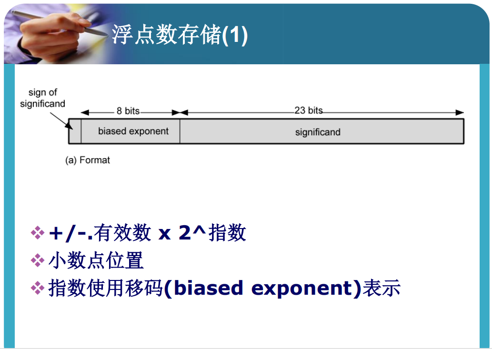
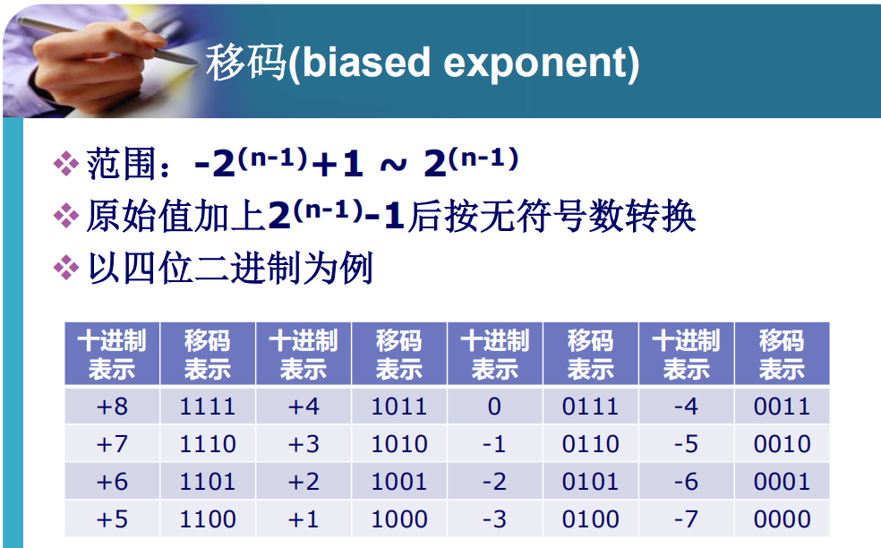

# 计算机算术章节总结

## 整数乘法

1. 无符号整数乘法
   - 用寄存器Q, M存储乘数和被乘数，用寄存器A存储积，加上一个一位寄存器C存储进位。注意，这里Q,M,A都是等长度的，(C,A,Q)共同组成了结果。
   - 算法：
     - 初始：将A,C置0，Q,M中分别放置第一个、第二个乘数。$cnt=0$
     - 循环：
       - 判断：
         - 若Q末位为1，则$(C,A)\gets A+M$
         - 若Q末位为0，则pass
       - 移位：$(C,A,Q)$共同向右移一位，C用0补齐。
       - $cnt\gets cnt+1$
     - 当$cnt=n$时结束循环。
2. 补码乘法（布思算法）
   - 用寄存器Q, M存储乘数和被乘数，用存储器A存储积。在Q的右边加上一个一位存储器$Q_{-1}$。A, Q, M等长度。(A,Q)共同组成了结果。
   - 算法：
     - 初始：$A, Q_{-1}$置0，Q, M中分别放置第一个、第二个乘数。cnt=0.
     - 循环：
       - 判断：
         - 若$(Q_0,Q_{-1})=00$或$(Q_0, Q_{-1})=11$，则pass
         - 若$(Q_0,Q_{-1})=10​$，则$A\gets A-M​$
         - 若$(Q_0,Q_{-1})=01$，则$A\gets A+M​$.
       - 移位：$(A,Q,Q_{-1})$整体右移一位，A最高位不变。
       - $cnt\gets cnt+1​$.
     - 当$cnt=n$时结束循环。

## 浮点数计算原理

1. 浮点表示

   浮点数用以下形式表示一个数:
   $$
   \pm S \times B^{\pm E}
   $$
   用这样的数保存在一个二进制字的三个字段中。

   - 符号：正或负（有效数的符号）

   - 有效值S（significand）: 2进制下约定第一位隐含为1。

   - 指数或者阶E（exponent）: 使用移码表示（表示范围$-2^{n-1}+1 \sim 2^{n-1}$)

   - 指数的底B是隐含的，不需要存储，对于所有的数都相同。这里取$2$.

     

     

   **具体分析：**

   1. 移码的使用（表示指数）：

      

   移码原始值加上$2^{n-1}-1$后按无符号数转换，把原$1000$映射成$1111$，拓展了负数域。

   从而，表示范围得以改为$-2^{n-1}+1 \sim 2^{n-1}​$。

   2. 有效值表示：

      约定在二进制存储中，有效值的最左位总是$1$，从而$1$不需要存储。

      

   **二进制浮点数存储的IEEE754标准：**

   分成单精度、双精度。

2. 浮点算数

   1. 浮点数加减法：
      1. 检查0。这个过程中可以统一符号。
      2. 对齐有效值。
      3. 执行加法。考虑符号等因素，可能出现有效值上溢，进而可能导致阶值上溢。
      4. 规范化结果。