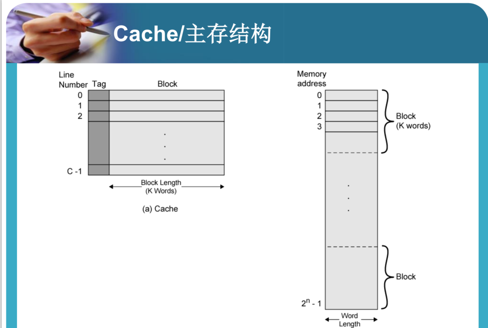
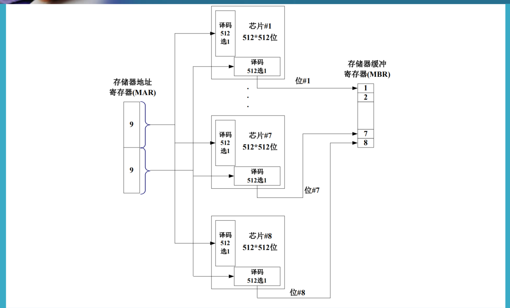
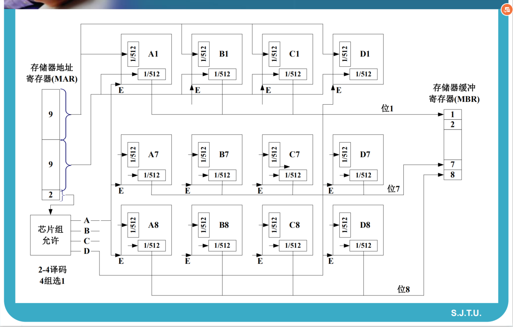
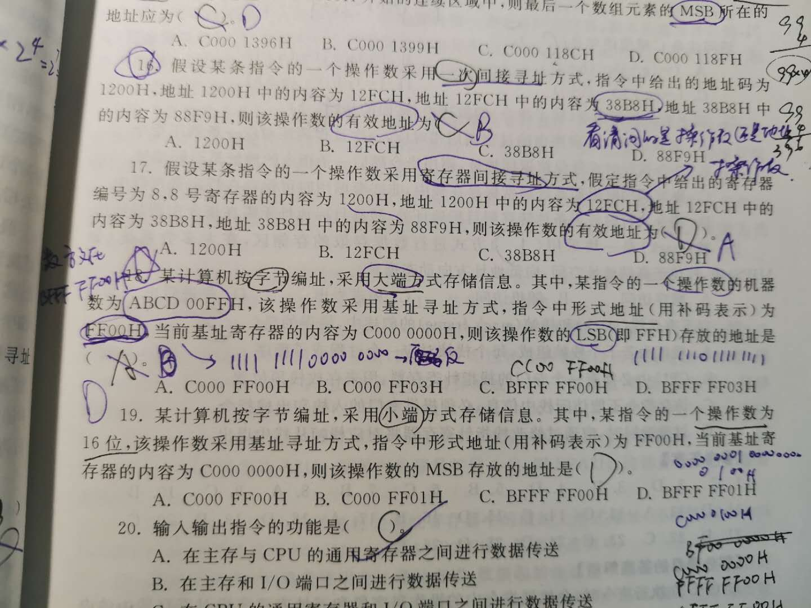
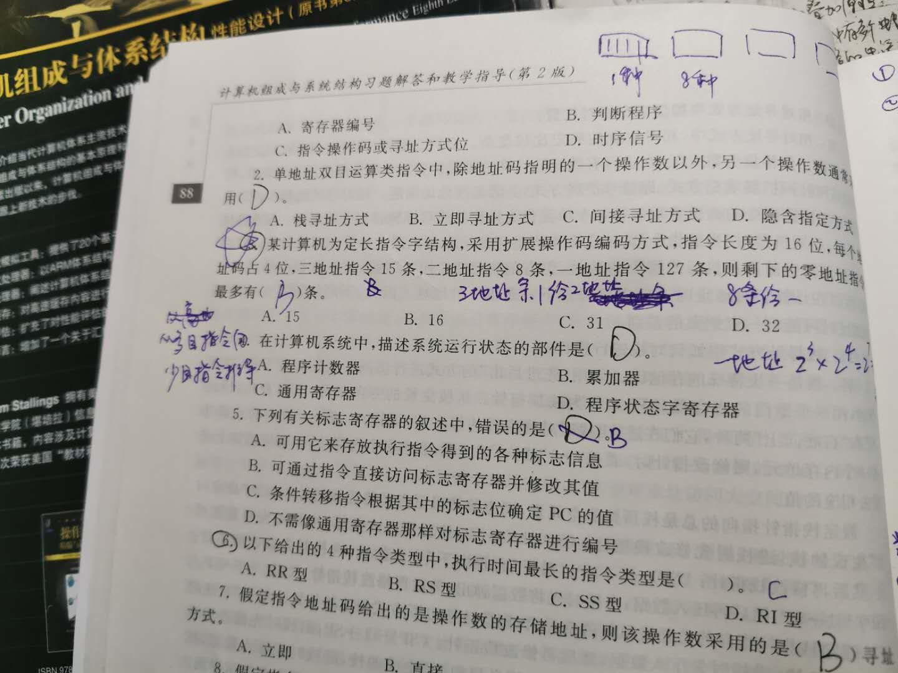

# 计算机组成笔记

## 02 计算机演变和性能

1. 计算机性能设计

   1. 微处理器

      1. 芯片制造技术

      2. 流水线和超标量

      3. 更复杂的指令分析技术

         1. 转移预测
         2. 数据流分析
         3. 推测执行

      4. 处理器和主存速度不匹配

         解决方案：

         1. 提高一次读取的数据位数：使DRAM接口更宽而不是更深
         2. 改进DRAM接口，使用Cache
         3. 减少存储器访问频度：更复杂高效的Cache
         4. 提高互连带宽：更高的总线速率，总线分层

   2. I/O设备

      1. 频繁I/O操作的外设
      2. 高数据吞吐量
      3. 处理器和外设之间传送数据的问题
      4. 解决方法
         1. Caching
         2. Buffering
         3. 更高速的互联总线
         4. 更精巧的总线结构
         5. 多处理器

   3. 平衡：

      1. 处理器不见
      2. 主存储器
      3. I/O设备
      4. 互联结构

   4. 芯片组织和体系结构的改进

      1. 提高处理器的硬件速度：减小芯片上逻辑门的尺寸
      2. 提高Cache的容量和速度：芯片专用Cache
      3. 改变处理器组织和体系结构：
         1. 提高指令的有效执行速度
         2. 并行

   5. 提高时钟频率和逻辑密度的问题

      1. 功耗
      2. RC（Resistive Capacitive）延迟
      3. 内存延迟（Latency）
      4. 解决方法：强调改善组织和体系结构

   6. 增加Cache容量

   7. 更复杂的处理逻辑

      1. 指令并行执行
      2. 流水线
      3. 超标量

   8. 收益递减：物理极限接近

   9. 新的方向：多核，共享大的Cache

2. X86和ARM

   1. x86的发展

      $8080\rightarrow8086\rightarrow80286\rightarrow80386\rightarrow80486\rightarrow pentium1,2,3,4\rightarrow core$

      core：Intel第一款x86双核处理器

   2. ARM：高速、小尺寸、低能耗

3. 计算机性能评估

   1. 时钟周期
      $$
      r_i=\frac{T_{ref_i}}{T_{sut_i}}
      $$
      $T_{ref_i}$是基准程序在被参照系统上的运行时间

      $T_{sut_i}$是基准程序在被测系统上的运行时间

      $r_G={(\Pi_{i=1}^nr_i)}^{1/n}$，全面性能

   2. 流水线

## 03 计算机顶层互联结构

1. 机器指令与指令周期

   1. 基本指令周期：取值周期（PC+1），指令存到IR、执行周期

2. 计算机中断技术：
   1. 加入指令周期
   2. 处理器通过中断信号检查是否发生中断：如果没有中断，则取下一条指令；
   3. 如果存在中断
      1. 挂起当前执行程序，保存当前场景
      2. 将PC设为中断处理器例程的起始地址
      3. 处理中断
      4. 恢复场景并继续执行被中断的程序
   4. 多重中断的处理
      1. 禁止中断：中断中不允许中断，处理好前一个中断后处理下一个中断，顺序处理
      2. 定义中断优先级：高优先级中断处理完后处理低优先级中断

3. 计算机顶层互联
   1. 系统组件
      1. 控制单元和算术逻辑单元组成CPU
      2. I/O部件
      3. 主存储器
   2. 存储器连接
      1. 接收和发送数据
      2. 接收地址/位置
      3. 接收控制信号
   3. I/O连接
      1. 接收来自计算机的控制信号
      2. 将控制信号发送到外设
      3. 接收来自计算机的地址信息
      4. 发送中断信号
   4. CPU连接

4. 计算机总线设计
   1. 总线
      1. 地址总线：决定能访问的地址空间大小	
      2. 控制总线
   2. 使用多级总线克服传输延迟和带宽瓶颈
   3. 总线类型
      1. 专用总线：分立的数据和地址总线
      2. 复用总线：共享线路，地址有效/数据有效控制线
   4. 总线仲裁：
      1. 不止一个模块能控制总线：CPU和DMA
      2. 任何时刻只允许一个模块控制总线
      3. 仲裁
         1. 集中式：一个特殊硬件（总线控制器/仲裁器）控制总线访问
         2. 分布式：每个模块都可以宣布对总线的访问，每个模块都包含控制逻辑

   ## 04 存储器分层与Cache

   1. 存储系统的特性

      1. 存储位置
         1. CPU：寄存器、Cache
         2. 主存（内存）
         3. 外存（辅存）
      2. 传输单位：
         1. 内存：通常等于数据总线宽度
         2. 外存：以块为单位，远大于字
         3. 可寻址单位：能唯一定址的最小单位
      3. 存取方式
         1. 顺序存取：从起始位置开始，如磁带
         2. 直接存取：每个数据块具有唯一地址，存取过程包括块内跳转和块内线性搜索，如硬盘
         3. 随机存取：每个可寻址单位具有唯一的地址，存取时间与数据位置无关，如主存
         4. 关联存取：根据地址或数据内容的样式确定存储位置，存取时间与数据位置无关，如Cache
      4. 性能参数
         1. 存储器周期时间=存取时间+下一次存取之前所需的附加时间
         2. 传输率：数据传入/传出的速率。
            1. 随机存取：1/存储器周期时间
            2. 非随机：$T_N=T_A+(N/R)$

   2. 分层存储系统

      1. 从上层至下层：寄存器、Cache、主存、磁盘、磁带

   3. Cache的原理和工作流程：

      

      **例题：**

      Q：

      考虑一个4行且每行16字节的cache，主存按每块16字节划分，即块0有地址0到15的16个字节，等等。现在考虑一个程序，它以如下地址顺序访问主存：

      一次：63 ~ 70

      循环10次：15 ~ 32，80 ~ 95

      （a）假设cache采用直接映射技术。主存块0, 4, ... 指派到行0；块1，5， ... 指派到行1；以此类推。请计算命中率。

      （b）假设cache采用二路组关联映射，共有两组，每组两行。偶序号块被指派到组0，奇序号块被指派到组1。请计算使用LRU替换策略的二路组关联cache的命中率。 

      **Answer：**

      1. 直接映射：
         - 63 Miss，将主存的第$3$块读进Cache的第$3$行
         - 64 Miss，将主存的第$4$块读进Cache的第$0$行
         - 65-70 hit。
         - 15 Miss, 将主存的第$0$块读进Cache的第$0​$行
         - 16 Miss, 将主存的第$1$块读进Cache的第$1$行
         - 17-31 hit
         - 32 Miss，将主存的第$2$块读进Cache第$2$行
         - 80 Miss，将主存的第$5$块读进Cache的第$1$行
         - 81-95 hit

        **以下循环$9$次**

      - 15 hit
      - 16 Miss
      - 17-31 hit
      - 32 hit
      - 80 Miss
      - 81-95 hit

      ------

        总共Miss $6+2*9=24$次，总共hit $36+32*9=324$次，cache命中率$\frac{324}{324+24}=0.931.$

      1. 组关联映射:

         - 63 Miss, 将主存第$3$块读进Cache第$1$组第$0$行
         - 64 Miss, 将主存第$4$块读进Cache第$0$组第$0$行
         - 65-70 Hit
         - 15 Miss, 将主存第$0$块读进Cache第$0$组第$1$行
         - 16 Miss, 将主存第$1$块读进Cache第$1$组第$1$行
         - 17-31 hit,
         - 32 Miss, 将主存第$2$块读进Cache第$0$组第$0$行
         - 80 Miss, 将主存的第$5$块读进Cache第$1$组第$0$行
         - 81-95 hit,

          **以下循环$9$次**

         - 15 hit
         - 16-31 hit
         - 32 hit
         - 80-95hit

      ------

      总共Miss $6$次，总共hit $36+34*9=342$次，Cache命中率$\frac{342}{342+6}=0.983$

   4. Cache的设计

      容量、映射功能、替换算法、写策略、块（行）大小、Cache的数目

      大Cache比小Cache略慢

      - 直接映射：直接利用映射函数$i=j(mod m)$
      - 全关联映射：主存块可映射到对应的Cache组内的任意一行
      - 组关联映射

      替换算法

      - 最近最少使用LRU
      - 先进先出FIFO
      - 最不经常使用LFU
      - 随机

      写策略

      - 写直达Write through：所有写操作都对主存和Cache进行，多个CPU监视主存变化保证自身Cache更新；产生大量存储信息量；写操作变慢
      - 回写Write back：写操作仅对Cache进行修改。
        - 修改Cache行时设置该Cache行的修改位；
        - 当Cache行被替换时，仅当其修改位被置位时才将该行数据写回主存

      ## 05 内存

      1. 内存类型和特性

          

      

   RAM(Random Access Memory)：可以读写，具有易失性，是暂时存储

   1. 动态RAM：（DRAM）用电容充电来存储数据，存在漏电现象，构造简单，成本低，速度较慢，用于主存
   2. 静态RAM：（SRAM）通过开关电路存储数据，没有漏电现象，不需要充电；每位体积较大、成本更高，速度较快，用于Cache

   ---

   

   存储器芯片的拓展

   1. 位拓展

      

      地址线给出后，上面一半9bit送入所有芯片的行信号，下面一半9bit送入所有芯片的列信号，8个芯片给出的1个bit拼在一起组成1个byte

   2. 字拓展：因为地址总线的限制，如果要把8bit变成32bit就不可以像上面一样进行简单的位拓展，而应该增加输出的列数，做字拓展

      

      芯片组允许，类似于数电中的使能引脚，进行2-4译码

   ---

   1. 存储器纠错：可以使用纠错码

   ---

   # 典型例题

   ## 指令系统

   1. 明确操作码和地址：

      

      需要明确所求是地址还是操作数，如16，17

   2. 大端/小端地址计算：如上图18.19

      注意，形式地址+基址寄存器运算，如18题，应该是C000 000H+FFFF FF00H=BFFF FF00H，补码表示的形式地址要在前面补FFFF

   3. 指令条数的计算

      

      如第三题。首先确定指令码高四位的取值（通过三地址指令条数确定），然后重复这一过程。